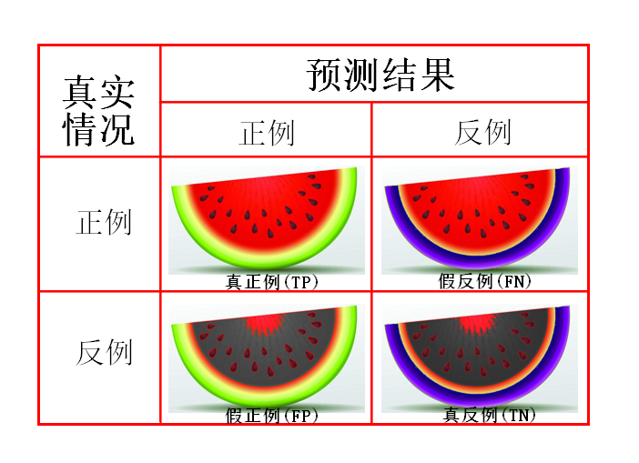

## 1.混淆矩阵
<table>
<tr>
<td rowspan=2>真实情况</td>
<td colspan=2>预测结果</td>
</tr>
<tr>
<td>正例</td>
<td>反例</td>
</tr>
<tr>
<td>正例</td>
<td>真正例(TP)</td>
<td>假反例(FN)</td>
</tr>
<tr>
<td>反例</td>
<td>假正例(FP)</td>
<td>真反例(TN)</td>
</tr>
</table>

- **真正例：**预测西瓜是好西瓜，实际上是好西瓜
- **假反例：**预测西瓜是坏西瓜，实际上是好西瓜
- **假正例：**预测西瓜是好西瓜，实际上是坏西瓜
- **真反例：**预测西瓜是坏西瓜，实际上是坏西瓜

我有 **(TP+FN+FP+TN)** 个西瓜，首先凭自己的判断，我将西瓜分成了两堆，一堆是我预测的好瓜,有：**TP+FP**个，另一堆是我预测的坏瓜，有：**TN+FN**个西瓜。先在我把所有的西瓜切开，我就知道每一个西瓜到底是好是坏，毕竟我之前的判断还是有问题的，我发现我预测的(TP+FP)个好瓜里有**FP**个坏瓜，我预测的(TN+FN)个坏瓜里有**FN**个好瓜。根据我的预测以及切开后的验证，将这一堆西瓜分成了四份！！！

---
## 2.查准率，查全率，真正例率，假正例率
### (1)查准率：一堆(TP+FN+FP+TN)的西瓜，我认为(TP+FP)是好瓜，实际上我预测的好瓜里只有TP个好瓜。

P=TP/(TP+FP)

### (2)查全率：一堆(TP+FN+FP+TN)的西瓜，实际上有(TP+FN)是好瓜，而我预测的好瓜里只有TP个好瓜。

R=TP/(TP+FN)

### (3)真正例率：一堆(TP+FN+FP+TN)的西瓜，实际上有(TP+FN)是好瓜，我把TP个好瓜预测为好瓜。

TPR=TP/(TP+FN)

### (4)假正例率：一堆(TP+FN+FP+TN)的西瓜，实际上有(TN+FP)是坏瓜，我把FP个坏瓜预测为好瓜。

FPR=FP/(TN+FP)

---
## 3.F1值

F1=2PR/(P+R)

