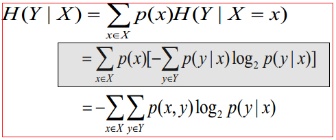
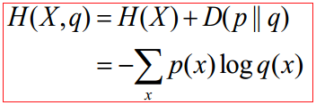
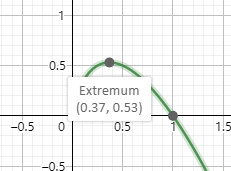

#信息论基础（以自然语言处理为背景）

| 概念 | 定义 | 理解 |
|-----|-----|-----|
| 1.熵H(X) | | 越不确定的随机变量熵越大 |
| 2.联合熵 |  | 联合熵实际上就是描述`一对随机变量`平均所需要的信息量。|
| 3.条件熵 |  |   |
| 4.熵率  |   |   |
| 5.相对熵，KL(距离) |   | 相对熵常被用以衡量两个随机分布的差距。 |
| 6.交叉熵 |   |交叉熵的概念用以衡量估计模型与真实概率分布之间的差异。|
| 7.稳态普遍性随机过程 |   |   |
| 8.困惑度 |   |   |
| 9.互信息  |   |在知道了Y的值以后X的不确定性的减少量,即Y的值透露了多少关于X的信息量。 |

## 附录：
f(x)=-xlog(x)的取值： 

